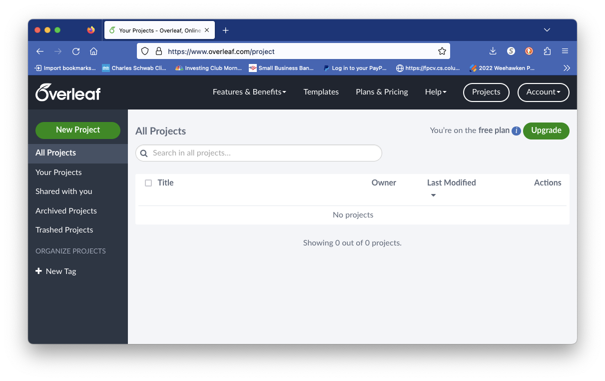
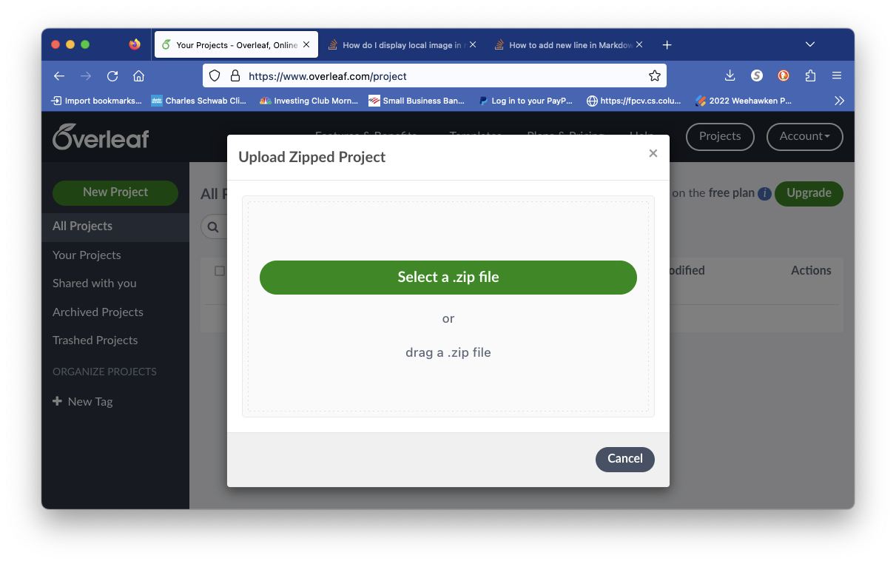
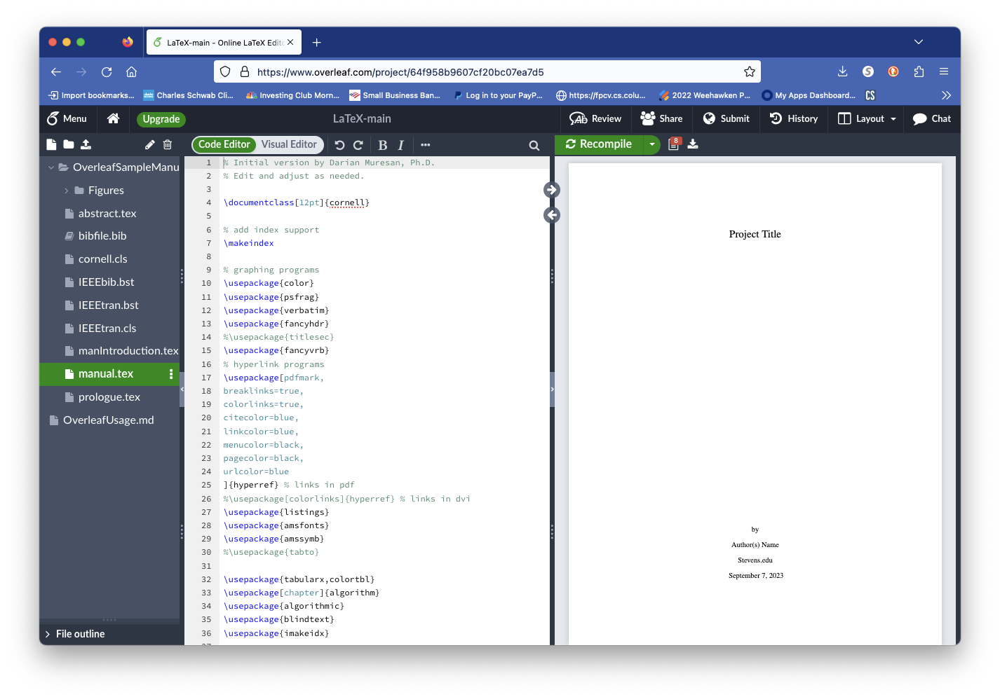

# LaTeX Manual Template</h1>

Using the LaTeX manual template in Overleaf: \
1. Download and create a ZIP file from the OverleafSampleManual directory.
2. Creat an accound and go to the main page after the account is created, as shown below:

3. Click on "New Project" then "Upload Project":

4. Select the ZIP file.  The project should automatically compile:

5. manual.tex is the main entry point in the project.
6. manIntroduction.tex is the introduction chapter.
7. To add a new chapter save manIntroduction.tex to a new file, say manClassDiagrams.tex. (In overleaf you add manClassDiagrams.tex firs and then copy/paste the contents 
of introduction.tex).
8. In manual.tex add manClassDiagrams.tex to \includeonly{}
and \include{}.   
<pre><code>
\includeonly{
prologue,
manIntroduction,
manClassDiagrams
}
</code></pre>
and 
<pre><code>
\singlespacing
\include{manIntroduction}
\include{manClassDiagrams}
</code></pre>
9. Study the contents of the template and play with 
things such as \label{} and \reference{}. 
10. Using Visio2000 you can create beautiful UML diagrams that can be saved as .EPS files and they can be integrated  beautifully into LaTeX files.  Go to the Visio2000 directory to read more about the UML stencils.