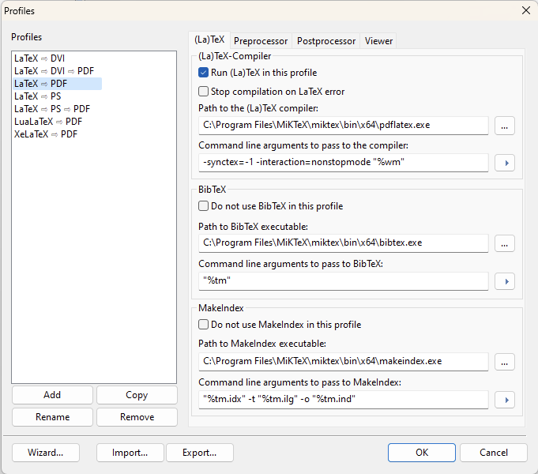

# Running LaTeX On a Windows Machine

Here are the steps for running LaTeX on your local Windows machine:
1. Download and install Ghostscript: https://ghostscript.com/releases/gsdnld.html
2. Download and install Ghostview: http://ghostgum.com.au/software/gsview.htm
3. Download and install SumatraPDF: https://www.sumatrapdfreader.org/download-free-pdf-viewer
4.  Download and install MikTex: https://miktex.org/download
    - During installation, answer YES when asked if to automatically download and install missing packages.
5. Download and install TexNicCenter: https://www.texniccenter.org/download/
6. Start TexNicCenter.
7. After starting the TexNicCenter for the very first time you will need to set up a few settings.  These settings can be configured at a later time from: *Build / Define Output Profiles ...*

8. The Profile that we want to use and edit is LaTeX=>PS=>PDF.
9. Click on the (La)TeX tab: \

    - Path to (La)TeX compiler: C:\Program Files\MiKTeX\miktex\bin\x64\latex.exe
    - Command to pass to the compiler: -synctex=-1 -interaction=nonstopmode "%wm"
    - Path to BibTeX: C:\Program Files\MiKTeX\miktex\bin\x64\bibtex.exe
    - Command to Bib TeX: "%tm"
    - MakeIndex executable: C:\Program Files\MiKTeX\miktex\bin\x64\makeindex.exe
    - MakeIndex command: "%tm.idx" -t "%tm.ilg" -o "%tm.ind"
10. Click the Postprocessor tab: \

    - Click DviPs (PDF): and verify:
        - Executable: \
        C:\Program Files\MiKTeX\miktex\bin\x64\dvips.exe 
        - Arguments: \
        -P pdf "%Bm.dvi"
    - Click Chostscript (ps2pdf)
        - Executable: \
        C:\Program Files\gs\gs9.56.0\bin\gswin64c.exe
        - Arguments: \
        -sPAPERSIZE=a4 -dSAFER -dBATCH -dNOPAUSE -sDEVICE=pdfwrite -sOutputFile="%bm.pdf" -c save pop -f "%bm.ps"
11. Click on the Viewer tab: \

    - Executable path: 

    C:\Users\DarianMuresan\AppData\Local\SumatraPDF\SumatraPDF.exe -inverse-search "\\"C:\Program Files\TeXnicCenter\TeXnicCenter.exe\\" /ddecmd \\"[goto('%f','%l')]\\""
    
    (You may have to put the exe path in double quoates if it contains spaces and obviously, replace *DarianMuresan* with your own user account.)
    - Command line: \
    "%bm.pdf"
    - Forwards search (DDE command): \
    [ForwardSearch("%bm.pdf","%Wc",%l,0,0,1)]
12. At this point you are ready to compile a LaTeX document, *but* the images have to be encapsulated postscript (.eps).  If you want to compile using PNG and JPG images, you have to change the profile to LaTeX=>PDF first.

13. There are some major advantages to using (.eps) files.  The two main ones are:
    - the figures will scale, if they are not bitmaps, beautifully.  They are vectorized files.
    - you can use the *PSFRAG* package to include beautiful math equations in your drawings and most importantly to add references or links.
14. To read more about using (.eps) files follow [RunLaTeXWithEPS](./RunLaTeXWithEPS.md).