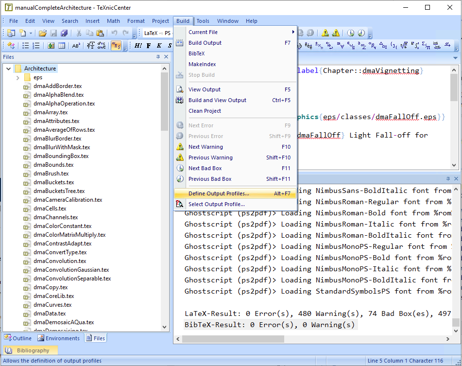

# Running LaTeX with EPS 

1. If running on Windows, as described in [RunLaTeXOnLocalWindows](./RunLaTeXOnLocalWindows.md), make sure that you have configured LaTeX=>PS=>PDF
    -  After starting the TexNicCenter for the very first time you will need to set up a few settings.  These settings can be configured at a later time from: *Build / Define Output Profiles ...*
    
    
    - Select: LaTeX=>PS=>PDF

    
    - Note that when configured to compile with EPS files, you cannot compile using PNG or JPG files.  If switching to EPS then all your image files have to be EPS files.  On Windows, I strongly recommend using Visio 2000, as described [here](./Visio2000/README.md), and saving your files as .eps files.  Unfortunately, Visio 2000 is the last version of Visio to support .eps output. To this day, I still feel that it's one of the best .eps output drawing program.  If you know of other programs that can produce beautiful .eps files (especially for UML diagrams) please let me know.  I'm always searching for good/better drawing tools.
2. Open the file manIntroduction.tex and comment out the reference to the PNG figure:
> %\begin{figure} \
> %\centering \
> %\scalebox{0.8}{\includegraphics{Figures/manAgileProcess.png}} \
> %\caption{\label{Figure::manAgile} Figure of the continuous agile process.} \
> %\end{figure} 

   And comment in the EPS figure:

> \begin{figure} \
> \psfrag{a }{\hspace{-0.8in}\large \begin{tabular}{c} Memory \\ Data \end{tabular}} \
> \psfrag{b }{$\sum_{i=0}^{N} x_i$} \
> \centering \
> \scalebox{1}{\includegraphics{Figures/manDenoise.eps}} \
> \caption{\label{Figure::manDenoise} Showing an EPS file with PSFRAG.  The EPS file was created in Visio 2000.  Note that the EPS file has letters 'a' and 'b' for the location that we want to replace.} \
> \end{figure}
3.  If everything works, you will see the following beautiful figure:

