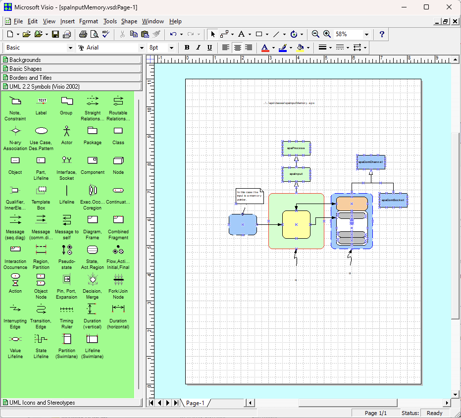

# Visio Stencils 

1. UML2.2 Visio 2002 stencils can be used with Visio 2000 to create .EPS files, which can be used with LaTeX and the *PSFRAG*
package to add links and mathematical formulas inside figures.  This is an *extremely* powerful feature for a professional documentation.
2. The stencils can also be downloaded directly from: \
http://softwarestencils.com/uml/index.html \
but are provided here for backup, in case the link becomes invalid.
3. To install Visio 2000 you need to first have a valid license of any Visio version, which can include the
current version.  Then you can download Visio 2000 from here:\
https://archive.org/details/visio-2000-enterprise 
4.  After the installation is complete, move the stencils to 
the Solutions directory in Visio, as shown below:

5. Open the UML 2.2 stencils and your Visio 2000 will look something like this:

